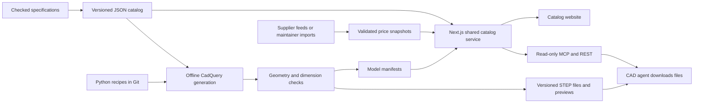

# Fastener MCP implementation specification

**Status:** Authorized for implementation and GitHub main merge by the user. Acceptance evidence is tracked in RELEASE_READINESS.md.

**Date:** September 21, 2026.

**Baseline:** Repository commit `19382b8`.

**Purpose:** Define executable work, interfaces, and acceptance criteria for the product agreed in this conversation. Writing this document does not authorize implementation, deployment, purchases, account setup, supplier outreach, or scheduled jobs.

This document reflects the decisions made after the opportunity review. Local geometry generation and a portable catalog take priority; a Zoo or Adam partnership is optional.

## 1. Product and success criteria

Fastener MCP gives AI CAD agents reliable models of real hardware, the information needed to incorporate that hardware into a design, and purchasing links for matching products.

The product must connect three things without ambiguity:

1. A precisely identified hardware specification.
2. A versioned CAD model representing that specification, with explicit simplifications.
3. Supplier products whose match to that specification has been checked.

The first complete release is successful when an MCP client can request a supported part, retrieve its validated STEP file and placement information, obtain applicable installation data, and compare matching supplier offers for a specified quantity. The website must expose the same underlying information.

“Any AI CAD agent” means any compatible MCP client can retrieve the data and files. Importing and placing geometry requires capabilities in the client's CAD environment; MCP access alone does not provide them.

### Decisions already made

| Decision | Requirement |
| --- | --- |
| Database | No Supabase, Neon, or other database in this version. |
| Catalog size | At most 1,000 active part identities initially. Historical revisions and geometry variants do not count as additional active parts. |
| Data storage | Versioned JSON in Git. |
| CAD generation | Local/offline Python with CadQuery and OpenCascade; no Onshape dependency. |
| Main CAD format | STEP; previews are supplementary. |
| Serving | Retain the existing Next.js application and HTTP MCP endpoint. |
| Model delivery | Pre-generate, validate, and publish. No CAD-kernel execution inside an MCP request. |
| Procurement | Offer comparison and links; no checkout or purchasing. |
| Commercial claims | Lowest comparable cost among named suppliers checked, with observation times and limitations. |
| Onshape | Retire the panel and write adapter from the active product. No replacement native CAD plugin is required. |

### Outside the first release

Automatic CAD mating, hole detection, arbitrary AI-generated replacement geometry, structural approval, load/torque recommendations, certified aerospace selection, automatic ordering, supplier account logins, company-private catalogs, and optimization of an entire purchase basket across suppliers are excluded. Native Adam/Zoo integration is not a prerequisite.

## 2. Current implementation and migration starting point

The baseline contains 188 catalog entries and 142 STEP files. Export summaries record 98 Onshape models and 44 CadQuery replacements. The four current MCP tools are `search_fasteners`, `get_fastener`, `get_fastener_model`, and `get_placement_packet`.

Before expanding the catalog, address these observed gaps:

- 140 catalog records lack an explicit diameter unit. Search compares raw diameters using a fixed tolerance across unit systems.
- The checked-in CadQuery fallback uses default dimensions rather than each part's specification. Its reproducibility must be repaired; existing binary files must be assessed independently.
- The placement packet's declared frame differs from the fallback generator's frame, and it equates total length with grip length.
- Model tools can return a protected deployment URL instead of the public asset origin.
- Existing recommendation logic ranks loosely matching parts and makes unsupported strength claims.
- File existence currently substitutes for geometry validation.
- Supplier-product mappings and maintained prices are absent.

Starting references: [catalog](../data/fasteners.json), [types](../lib/types.ts), [MCP route](../app/api/mcp/route.ts), [placement builder](../lib/placement-packet.ts), [generator](../scripts/generate-cadquery-step.py), [recommendation route](../app/api/recommend/route.ts).

These counts describe existing assets, not verified product coverage. Migration must not label imported records or models as validated simply because they already exist.

## 3. Initial catalog coverage

The full product supports screws/bolts, nuts, washers, and wire-thread inserts, including identified HELICOIL products where source data permits. Treat HELICOIL as a manufacturer/product identity, not an automatic synonym for every wire-thread insert.

Build a launch set of at least 24 checked part identities across six families: hex-head bolts, socket-head screws, countersunk screws, hex nuts, flat washers, and free-running wire-thread inserts. Target at least three identities in each family and use the remaining identities to demonstrate useful compatible combinations. Select exact sizes during the source-data audit; do not invent dimensions to meet the count.

Start predominantly with common metric sizes. Include at least one verified inch-thread pair before claiming inch-thread support; until then, retain unverified inch records as legacy data and reject unsupported conversions. Explicitly report coverage by category, standard, units, geometry detail, and installation data.

An active launch part must have:

- An unambiguous identity and all dimensions needed by its supported generator.
- Sources and recorded verification for identity-critical and modeled dimensions.
- A passing simplified STEP model with a declared frame.
- A preview and an explicit list of omissions.
- Installation requirements where applicable, or an explicit unavailable result.

Supplier coverage is independent: a valid model may have no supplier listing. Missing offers must not hide or invalidate geometry. At least ten launch parts must have checked purchase links, and at least five must have comparable, fresh observations from two suppliers before price comparison is called complete.

Material or finish variants may share identical geometry, but remain distinct part identities when their purchasing requirements differ. Deduplicate geometry assets without merging those identities.

## 4. Architecture and storage

Keep the following logical layout. Implementers may adjust filenames to repository conventions while preserving these separations.

| Location | Purpose |
| --- | --- |
| `data/catalog/parts.json` | Current part revisions and statuses. |
| `data/catalog/sources.json` | Provenance and permitted-use metadata. |
| `data/catalog/installations.json` | Sourced hole and installation definitions. |
| `data/catalog/compatibility.json` | Explicit compatibility rules and checked relationships. |
| `data/catalog/suppliers.json` | Supplier configuration and refresh policy. |
| `data/catalog/supplier-products.json` | Verified supplier-SKU-to-part mappings. |
| `data/catalog/releases/<release-id>.json` | Immutable release manifests referencing exact data/artifact revisions. |
| `data/catalog/history/` | Published historical part and model metadata needed for pinned retrieval. |
| `data/offers/current.json` | Published snapshot of commercial observations. |
| `data/geometry/manifest.json` | Geometry identities, validation state, and asset paths. |
| `public/models/<geometry-id>/<version>/` | Immutable published STEP and preview assets. |
| `scripts/geometry/` | Family recipes, generation entry point, validation, and reports. |
| `scripts/catalog/` | Migration, schema validation, cross-reference checks, and release construction. |
| `scripts/suppliers/` | Source adapters and snapshot refresh tooling. |
| `lib/catalog/` | Shared loading, filtering, matching, compatibility, and offer comparison. |

Keep an adapter for legacy `data/fasteners.json` consumers until the UI and API have moved to the shared service. Do not maintain two independently editable catalogs.

Read JSON into memory once per application process. Index IDs and common filters. Do not write to the runtime filesystem; publishing is a build/release operation. One controlled maintainer process publishes snapshots so concurrent updates cannot overwrite each other.

Initially deploy assets and JSON with the app. Use a configured canonical public origin, independent of Vercel preview hostnames. Verify anonymous downloads. An asset path abstraction must permit later movement to object storage without changing part IDs or MCP contracts; external storage is not required now.

## 5. Data contracts

All documents carry `schema_version`. Published responses carry `catalog_release`; offer responses also carry `offers_snapshot`. Validate JSON at ingestion and build time, using shared schemas rather than unrelated definitions for REST, MCP, and UI.

Store filterable fields explicitly. JSON flexibility is for family-specific dimensions and extensions, not a replacement for a defined schema. Use null for unknown data and a separate applicability flag where “not applicable” differs from “unknown.”

### 5.1 Part identity and specification

| Field group | Required contents |
| --- | --- |
| Identity | Stable `id`, `revision`, `designation`, category, standard references, aliases, optional manufacturer and manufacturer part number. |
| Publication | `draft`, `active`, `legacy_unverified`, or `deprecated`; verification date; superseding identity/revision when relevant. |
| Thread | System, nominal size, normalized nominal diameter, pitch in mm and/or original TPI, handedness, thread class if specified, internal/external role. Unthreaded parts explicitly declare no thread. |
| Dimensions | Named numeric values with units and source references. Preserve source values; provide derived normalized mm values with their derivation. |
| Length meaning | Under-head, overall, thickness, installed insert length, or another explicitly defined convention. Grip/unthreaded length is a separate field. |
| Attributes | Specific material, strength/property grade if known, finish, head type, drive type, and relevant insert type. |
| References | Source IDs and field-level evidence; applicable installation IDs; supported geometry references. |

Distinguish nominal thread diameter from an actual modeled major diameter. Distinguish across-flats from across-corners dimensions and circular head diameter. Required tolerances belong to the specification; numeric comparison tolerances belong to the software and must not silently relax the specification.

Changing an identity-defining attribute creates a new part identity. Correcting metadata about the same identified part creates a revision. Preserve existing valid IDs. If a legacy ID describes the wrong physical part, deprecate it and explain the correction rather than silently reassigning its meaning.

### 5.2 Provenance

Each source records an ID, document/product title, publisher, URL or locator, revision (or explicitly unknown), retrieval date, source kind, and known usage/license information. Each sourced field identifies the relevant table, page, drawing, or product attribute where possible.

Separate source authority, extraction verification, and geometry validation. A vendor webpage link alone does not make a dimension verified. An existing `confidence: exact` value is not proof. Retain references to restricted source documents without publishing their contents unless redistribution is permitted.

### 5.3 Geometry manifest

Each geometry variant records:

- Geometry ID, version, matching part revision(s), recipe ID/version, normalized parameter hash, and Python/CadQuery/kernel versions.
- Format, `simplified` or `detailed` detail level, and `installed`, `uninstalled`, or `not_applicable` state.
- Immutable relative asset path, byte size, SHA-256, preview paths, units, bounding box, and declared datums.
- Validation state (`pending`, `passed`, `failed`, `withdrawn`), check-report path, timestamp, and fixture tolerances.
- Represented features, omitted features, and intended uses such as layout/reference.

Do not call a model certified or manufacturing-ready because topology and dimensional checks pass. “Validated” always refers to the listed checks.

### 5.4 Installation and compatibility

Installation records contain the installation type, applicable part revisions, source references, host-material/process conditions where relevant, and named dimensions. Examples include clearance diameter, counterbore diameter/depth, countersink angle, tap designation, drill diameter, blind-hole depth, insert seating depth, and tang handling.

Do not infer a wire insert's receiving thread from the screw thread alone. Record the specified insert tap/holding-thread requirements. Do not label a generic hole as compatible with every material or installation process.

Compatibility records identify both parts, applicable revisions, relationship type, checked attributes, conditions, source/rule version, and unresolved requirements. Return `compatible_for_stated_constraints`, `incompatible`, or `insufficient_information`; never a blanket “safe.”

### 5.5 Supplier products and observations

Keep supplier identity and product mappings separate from changing observations.

| Record | Fields |
| --- | --- |
| Supplier | ID, name, supported markets, approved feed/import method, refresh policy, source URLs. |
| Supplier product | Supplier ID and SKU, manufacturer identity when available, exact variant URL, mapped part ID/revision, pack unit, checked attribute mapping, match status, verification timestamp. |
| Price observation | Product reference, observed time, explicit currency, price basis (each/pack), tier definitions, pack size, MOQ/order increments, price scope (public/quoted/account-specific), validity if provided. |
| Availability observation | Product reference, checked time, stock status and quantity if known, dispatch/arrival information with destination scope. |
| Charge observation | Shipping, tax, and duty amounts when known; destination and quantity applicability, currency, time/expiry, and estimation status. |

Represent money as decimal strings and calculate with decimal arithmetic or integer minor units. Never use floating-point currency totals. Unknown stock, shipping, taxes, or prices are null/unknown, not zero. Store snapshot history in Git initially; do not add a history database.

## 6. Geometry generation and validation

### 6.1 Generation pipeline

1. Select explicit part IDs, supported families, and detail/state variants from checked catalog inputs.
2. Validate required parameters and source status. Missing dimensions produce a blocked build report, not default geometry.
3. Compute a build key from recipe, parameters, part geometry revision, and toolchain versions.
4. Reuse an already passing artifact only when its build key and saved-file checksum match. Otherwise generate into a staging directory.
5. Export STEP, reopen that exported file with the CAD kernel, and run the validation suite.
6. Produce and inspect a preview; store the report and asset hash.
7. Publish passing outputs and their manifest together. Failed work must not replace a published model.

Implement family-specific recipes for hex bolts, socket screws, countersunk screws, hex nuts, flat washers, and wire inserts. Fix the current default-dimension fallback; unknown family types must fail explicitly. Do not route all unknown parts through a generic screw recipe.

No generation is triggered by public search/download calls. A supported size missing from published assets returns `MODEL_UNAVAILABLE` and a reason. Adding a size is a maintainer workflow that goes through source checks and publication.

Geometry should reproduce within declared tolerances under a pinned toolchain. STEP exporters may include timestamps; do not promise identical bytes across independent rebuilds. Once published, retain the exact artifact and checksum rather than overwriting it on a later rebuild.

### 6.2 Detail and insert state

Simplified models must preserve the dimensions and interfaces declared as represented. Explicitly list omitted thread helices, small chamfers, fillets, or other details. Cosmetic detail must not imply thread-fit validation.

Support detailed geometry for at least one screw family with two checked variants in the first complete release. Every other unsupported detailed request returns `UNSUPPORTED_VARIANT`; never silently substitute simplified geometry. Expand detailed coverage later.

Wire inserts default to an installed representation. A simplified installed envelope must be named as such, and cannot be used to claim wire-level collision/contact behavior. Detailed coils and uninstalled geometry require their own sourced dimensions and checks; do not derive their free-state diameter by guessing from the nominal screw diameter. Uninstalled output is optional in the first release but the contract must represent it.

### 6.3 Frames

Use right-handed frames and mm for geometry. Exported numeric geometry and metadata must agree.

| Category | Origin and +Z convention |
| --- | --- |
| Non-countersunk screw/bolt | Center of head bearing face at Z=0; shank extends toward +Z; head extends into -Z. |
| Countersunk screw | Center of the flush top plane at Z=0; screw extends toward +Z. State the total-length convention and cone geometry. |
| Nut/washer | Center of a designated lower seating face at Z=0; body thickness extends toward +Z. |
| Installed insert | Center of the insertion-side reference plane at Z=0; insert extends into the host along +Z. Seating depth relative to the host surface is separate. |

Record rotational reference axes for hex flats and drives. Use per-category datum names instead of falsely assigning a head-bearing face to every part. Placement packets describe local geometry and datums; they do not create CAD mates or claim a constraint solver.

### 6.4 Required checks

- Exported STEP reopens successfully, has the expected solid count, valid topology, positive volume, and finite dimensions.
- Every promised geometric dimension matches its fixture expectation within an explicit numerical tolerance. Use source-defined expected values independent of the recipe's output calculations.
- Check bore openness in nuts/washers, head/shaft continuity, countersink angle, representative cross-sections, and datum orientation as applicable. A bounding box alone is insufficient.
- Separate source dimensional limits from numerical validation tolerances. Choose nominal values inside sourced limits; document the chosen nominal convention.
- Use a default numerical length tolerance of 0.01 mm for simple nominal fixtures unless a fixture specifies a tighter/appropriate tolerance. This is a software acceptance threshold, not a manufactured-part tolerance or standard-compliance claim.
- Inspect at least one rendered view for every newly published geometry variant, with additional views for internal features. Record reviewer/check status.
- Verify asset SHA-256 and byte size after export. A text search for `MANIFOLD_SOLID_BREP` alone is not a validation pass.

Follow the applicable local CAD skill instructions when implementation reaches generation or geometry inspection.

## 7. Search, matching, installation, and bundles

Hard constraints are filters, not scoring bonuses. A part missing evidence for a required grade/material/thread is not an exact match.

Search accepts text plus structured category, standard, thread system/size/pitch, handedness, head/drive type, length, material, grade, finish, source status, and available geometry detail. Numeric diameter/length inputs require a unit. Use thread designation parsing for recognized designations; do not compare inch numbers directly with mm numbers.

Define exact nominal-size matching, explicit numeric ranges, and text relevance independently. Do not reuse the current `< 0.5` tolerance. Normalize equivalent unit inputs without equating different thread systems merely because diameters are close.

Results include matched requirements and missing/conflicting fields. Exact matches appear first. Alternatives are opt-in and returned separately with differences, never mixed into an exact-match list. No results is a successful empty result; ambiguity returns candidate choices and missing requirements rather than choosing arbitrarily.

Installation requests return documented conditions and required missing context. For example, a blind-hole instruction requiring host material must return `insufficient_information` when material is absent. Do not generate unsupported numbers from an LLM.

Bundle requests accept an anchor part, requested companion categories, quantities, and optional explicit assembly constraints. Match thread system, size, pitch, handedness, and known class requirements. Check washer opening/seating dimensions where known. Check engagement/grip only when the necessary stack dimensions and source rules are supplied. Without them, return a component shortlist with unresolved assembly checks.

BOM output includes part IDs/revisions, designations, quantities, geometry references, optional chosen supplier SKUs, and unresolved fields. Provide JSON and CSV. Do not calculate joint strength or claim a complete engineering-approved assembly.

## 8. Supplier matching and price comparison

### 8.1 Mapping products to geometry

Use supplier APIs, permitted feeds, or maintainer imports with recorded source evidence. Start with manual mapping/imports where automated access is unavailable; do not make the first release depend on a comprehensive web crawler. Supplier selection must follow actual data availability and coverage, not assumed API access.

Confirm all identity-critical fields before assigning `exact` mapping status. A product with an unspecified grade cannot satisfy a request for a specific grade. A similar-looking product, family page, or generic search link is not a verified exact product variant. Distinguish `exact`, `conditional_alternative`, `unverified`, and `rejected` mappings.

When a standard defines a dimensional range, a supplier's exact product may vary within it. Mark whether the CAD model is a standard nominal representation or a supplier-specific model. Do not promise the physical product is identical to every surface of a nominal/simplified model. Supplier-specific differences affecting represented geometry must reference a separate geometry variant.

### 8.2 Comparison request and calculation

Required input: selected part ID/revision, requested quantity, destination country, and currency. Optional inputs: postal code where needed, latest acceptable arrival date, allowed suppliers, and explicit permission to include alternatives. Default the website's initial market to US/USD and show that choice; MCP callers must supply destination and currency.

Calculate each offer in this order:

1. Exclude unsupported destinations and unverified/mismatched products from the exact-match group.
2. Apply MOQ, pack size, and order increments to determine the actual purchasable quantity. Report requested, purchased, and excess quantities.
3. Select the applicable price tier using that supplier's declared tier basis. Do not assume tiers are always per individual item.
4. Calculate merchandise subtotal using actual purchasable quantity and the stated each/pack price basis.
5. Add only charges whose quantity, destination, currency, scope, and validity match the request. Distinguish known charges from estimates and missing charges.
6. Apply known stock and delivery constraints. A hard arrival deadline is not satisfied by unknown shipping time or an unrelated dispatch estimate.
7. Rank within comparable groups and explain the ranking basis.

For simple packs, purchased quantity is `pack_size × ceil(max(requested_quantity, minimum_quantity) / pack_size)`, followed by any additional supplier order-increment constraint. More complex ordering rules must be modeled explicitly or the offer marked uncomputable.

Return three comparison groups where applicable:

| Group | Meaning and ranking |
| --- | --- |
| Complete comparable totals | Matching scope and all requested cost components known; rank by total. |
| Partial/estimated costs | Rank merchandise subtotal or documented estimated total separately; list missing components. Never present as the definitive delivered-cost winner. |
| Links only / ineligible | Unknown/stale price, unavailable stock, incomplete mapping, unsupported destination, or deadline not established; include reasons and do not assign a cheapest rank. |

Do not compare currencies using an assumed exchange rate. First release compares only the requested currency; cross-currency conversion is deferred. Do not mix account-specific prices with public offers unless the request explicitly selects the same eligible pricing scope. Do not sum per-line shipping estimates to claim an optimized basket total.

### 8.3 Freshness and refresh

Every source defines maximum ages for price and stock observations. Initial default policy is 24 hours, overridden by shorter supplier validity and configurable per source. This is the application's freshness policy, not a guarantee a supplier's price remains valid for 24 hours. Shipping/quote expiry takes precedence when present.

Keep price, stock, and delivery timestamps separate. A successful link check does not refresh an old price. Failed refreshes retain the last observation with its original timestamp and error state; stale offers cannot win a fresh-price comparison. If all offers are stale or incomplete, return purchase links and explain that no current comparable winner is available.

The refresh script accepts supplier IDs and writes a candidate snapshot. Schema validation, mapping checks, monetary checks, and source policy checks run before publishing. Publish one complete snapshot atomically; do not replace missing data with zeros. Network failures must not erase existing valid records.

Default operational cadence after implementation is a daily maintainer-run refresh. A daily CI job can later be configured once supplier access and deployment credentials are in place. No automation is created by this specification. Runtime MCP requests do not scrape suppliers or consume a live pricing quota.

## 9. MCP and REST interfaces

Retain `/api/mcp` and share business logic with the REST handlers and website. MCP tools are read-only. Do not expose model-generation commands, arbitrary filesystem paths, arbitrary URL fetching, catalog writes, or purchasing tools.

### 9.1 Tool contract

| MCP tool | Inputs | Result |
| --- | --- | --- |
| `search_fasteners` | Query and explicit filters from section 7; `include_alternatives`; limit and cursor. | Compact candidates, match classification/reasons, availability of geometry, total and next cursor. |
| `get_fastener` | Part ID; optional revision. | Full specification, source evidence, publication status, geometry/installation references. |
| `get_fastener_model` | Part ID/revision; detail level default `simplified`; state default appropriate to category; optional geometry version. | Download URL, checksum, bytes, units, frame, validation report summary, omissions, and exact selected versions. |
| `get_placement_packet` | Same variant selection as model lookup. | Versioned geometry reference and category-specific local datums; no Onshape adapter or automatic mating claim. |
| `get_installation_requirements` | Part ID/revision, installation type, optional host material/process and blind/through-hole context. | Applicable sourced dimensions/instructions, conditions, missing inputs, and status. |
| `get_compatible_parts` | Anchor part ID/revision, companion categories, quantities, optional assembly constraints. | Checked candidates and unresolved conditions; optional BOM lines for explicitly selected parts. |
| `compare_supplier_offers` | Part ID/revision, quantity, destination, currency, deadline/supplier/alternative filters. | Comparison groups, purchasable quantities, costs, observation times, source coverage, winner only where justified. |
| `build_parts_list` | Explicit part IDs/revisions and positive quantities; optional selected supplier-product IDs. | Aggregated JSON BOM and CSV text with versions, unresolved fields, and no automatic orders. |

Use structured MCP results with a short text summary; preserve machine-readable text compatibility where required by the installed SDK. Do not embed STEP bytes or large images in tool results. Default search limit 20, maximum 100; full records are retrieved by ID.

Search results distinguish exact matches from alternatives through separate arrays. Unverified and deprecated records are excluded from normal search unless explicitly requested, but remain inspectable by ID.

### 9.2 REST equivalents

Keep existing read routes and add equivalents:

| Route | Purpose |
| --- | --- |
| `GET /api/fasteners` | Search, filters, pagination. |
| `GET /api/fasteners/:id` | Part detail and optional revision. |
| `GET /api/fasteners/:id/model` | Geometry manifest/URL; this remains JSON, not the STEP byte stream. |
| `GET /api/fasteners/:id/placement` | Placement packet. |
| `GET /api/fasteners/:id/installation` | Installation requirements with context query parameters. |
| `POST /api/compatibility` | Compatibility request; read-only despite POST. |
| `POST /api/offers/compare` | Offer comparison; read-only. |
| `POST /api/bom` | Parts-list assembly; read-only. |
| `GET /api/catalog/status` | Release/schema versions, coverage, model counts/status, offer snapshot age; no secrets. |

Every success response identifies the selected catalog release and any pinned revisions. Cursors are stable within that release; return an explicit expired-cursor error if used against a different release. Invalid filters and malformed units must not silently broaden a search.

Use a shared error payload with `code`, human-readable `message`, relevant `details`, and `retryable`. Minimum codes: `INVALID_INPUT`, `AMBIGUOUS_UNITS`, `PART_NOT_FOUND`, `REVISION_NOT_FOUND`, `UNSUPPORTED_VARIANT`, `MODEL_UNAVAILABLE`, `MODEL_WITHDRAWN`, `INSUFFICIENT_INFORMATION`, and `CURSOR_EXPIRED`.

REST uses 400 for malformed input, 404 for unknown identities/revisions, 410 for withdrawn assets/retired endpoints, and 422 for valid requests that cannot be fulfilled due to missing evidence or unsupported variants. MCP uses its tool-error mechanism for equivalent failures. Empty searches and offer comparisons with no qualifying winner are successful results with explicit reasons, not server errors.

### 9.3 Compatibility with existing clients

Keep the four existing tool names and valid part IDs. Add versioned response fields, update the advertised server version to reflect breaking semantics, and document the migration. Placement becomes `fastener-mcp.placement.v1`; do not silently reinterpret v0 coordinates.

Ambiguous unitless numeric search requests now fail with actionable errors. Existing exact-ID lookups continue working where the identity is valid. Existing `/api/recommend` is deprecated; return 410 with directions to explicit search/compatibility instead of retaining unsupported strength rankings.

Keep old flat STEP URLs only for individually checked assets whose content is correct; redirect them to the matching immutable version and label them as unpinned legacy links. Incorrect/unverified legacy files must be removed from public serving and return unavailable/withdrawn responses, not remain accessible simply for compatibility. Preserve historical metadata and explain withdrawals.

## 10. Website behavior

Keep the current visual system; do not require a redesign to deliver the product.

- **Browse/search:** explicit units, category/thread/material/standard filters, clear exact-match versus alternative results, and visible model availability.
- **Part detail:** sourced dimensions, material/finish, revision, model preview, omissions, detail/state selection, download, placement reference, and installation information.
- **Companion parts:** show checked nuts/washers/inserts with the reason for matching and any unresolved assembly requirements.
- **Purchasing:** quantity, destination, currency, optional deadline, exact supplier variants, pack quantities, comparison basis, observation times, and unknown charges.
- **Parts list:** simple browser-local selection and quantities, JSON/CSV export; no account or shared persistent project feature required.
- **MCP guide:** server URL, available tools, an exact-part example, expected errors, download/import workflow, and scope of compatibility.

Provide generated image previews initially; a full interactive STEP viewer is optional and must not block release. All filters and downloads must be usable by keyboard, with labeled fields, readable status messages, and mobile layouts.

Remove the Onshape panel from navigation and product instructions. Retire its write endpoint and remove active credential/default-document code paths. Old documentation may remain clearly marked historical with links to the new workflow. The public catalog does not require user accounts.

## 11. Maintenance, publication, and operational limits

### Catalog publication

Use staged data and assets. Validation must check unique IDs, schema versions, referenced sources, part/geometry revision consistency, asset existence/checksums, compatibility references, and supplier mapping integrity. A release with a missing or failed referenced asset must not publish.

Publish catalog and geometry manifest together in one deployment. Price snapshots may be updated in separate deployments, but must reference existing compatible part revisions and identify their own snapshot version. Never overwrite a pinned geometry asset. Retain the previous complete release so rollback restores consistent data and files.

Corrections create new revisions. A changed part specification invalidates dependent compatibility/mapping verification where affected; a changed recipe invalidates its previous validation cache. A confirmed bad published model is withdrawn, with its historical metadata retained and download disabled. Stability does not require continuing to serve known incorrect geometry.

### Backups and capacity

Git retains source data, recipes, schema history, and initial artifacts. Preserve published releases and assets when rolling deployments forward. Track repository/asset size and deployment limits; the 1,000-part target alone does not guarantee detailed CAD files remain small. Move versioned blobs to object storage if deployment constraints require it, while keeping metadata in JSON.

No database, queue, vector index, or job platform is required. Price refresh and geometry generation are batch tools. Native Python/CAD dependencies must run in a pinned local environment or a suitable build runner, separate from Next.js request execution.

### Access and observability

Expose only catalog read operations publicly. Keep supplier credentials in environment-managed secrets for offline/CI tasks, never JSON or responses. Validate IDs against the catalog before building paths, enforce input bounds, and escape CSV fields beginning with spreadsheet formula characters. Public endpoints must not become open fetch proxies.

Record request/tool name, duration, status, catalog release, and artifact/version where useful. Log refresh and generation outcomes separately. Use hosting-layer request limits if needed; do not introduce a database just for rate limiting. Avoid storing customer design content as part of routine logs.

## 12. Implementation work packages

Execute in dependency order after separate authorization to implement. Each package must leave a reviewable change with its acceptance evidence. Do not deploy automatically at the end of a package.

| Package | Concrete work | Exit condition |
| --- | --- | --- |
| P0 — Baseline and audit | Inventory current records/assets; preserve baseline; classify missing sources, units, and geometry problems; choose launch subset; inspect installed Next.js docs before coding. | Audit report lists every existing ID and model, proposed identity corrections, and launch coverage. No legacy model is assumed validated. |
| P1 — Data contracts and migration | Add schemas, shared types/loading, source and history records, migration/validation tools; convert legacy catalog conservatively. | Every record has explicit status and unit handling; invalid data fails build; valid IDs preserved; historical metadata retrievable. |
| P2 — Geometry pipeline | Replace default generator; implement six recipes, frames, staging, manifests, checks, previews, cache keys, and pinned environment. | Launch geometry passes exported-file checks and visual review; one family has two detailed variants; build runs without Onshape credentials/network. |
| P3 — Retrieval and MCP | Implement shared exact search, versioned model/placement responses, canonical URLs, pagination/errors, and catalog status. | REST/MCP parity; anonymous download and hash verification; unit/variant regressions rejected; SDK conformance checks pass. |
| P4 — Installation and combinations | Add sourced installation records, conditional compatibility, explicit BOM export, and related tools/routes. | Launch examples demonstrate screw/nut/washer and screw/insert combinations; missing context is explicit; BOM quantities and identities are correct. |
| P5 — Purchasing | Add supplier mappings, adapters/manual import, snapshots, freshness, quantity calculations, comparison groups, and purchasing tools/routes. | At least ten parts have verified links; five have fresh comparable observations from two suppliers; price acceptance cases pass. |
| P6 — Website and retirement | Connect pages to shared service, previews, purchasing and parts list; update MCP docs; remove active Onshape flows and old recommendations. | All launch workflows work through UI and MCP; historical links are handled deliberately; no advertised Onshape dependency. |
| P7 — Release readiness | Run full checks, inspect release artifact, test a real client/download/import path, document maintenance and rollback; prepare deployment notes. | Release checklist passes; external-data gaps are reported accurately; release is ready for separately authorized deployment. |

P5 may begin after P1 once part identities are stable, but its release must use the same final catalog revisions. Do not let lack of supplier access prevent completing geometry packages; equally, do not mark purchasing or the full release complete without real supplier evidence.

## 13. Acceptance tests

Tests must exercise behavior and independent expected values, not merely repeat implementation formulas. Keep external live checks separate from deterministic fixtures so a supplier outage does not masquerade as a code regression.

| ID | Test | Passing evidence |
| --- | --- | --- |
| A01 | Search equivalent metric and explicit inch inputs. | Unit normalization is correct; numerically similar incompatible threads never become exact matches. |
| A02 | Send ambiguous diameter, missing grade, and conflicting length. | Actionable validation/ambiguity; no silent relaxation or arbitrary substitution. |
| A03 | Ask for an unsupported part/detail/state. | Explicit unavailable result, no default 4 mm × 20 mm geometry and no renamed substitute. |
| A04 | Build every launch geometry and reopen exported STEP. | All declared topology, dimension, frame, and preview checks pass with recorded tolerances. |
| A05 | Check nuts, washers, countersunk screws, and inserts. | Open bores, correct named datum, length convention, countersink/insert state, and declared omissions. |
| A06 | Retrieve published version after a newer release. | Same pinned bytes and checksum unless explicitly withdrawn; unpinned lookup identifies new selection. |
| A07 | Download the URL returned by the actual MCP model tool anonymously. | Response is STEP, not login HTML; size/hash and import are correct. |
| A08 | Compare REST and MCP for the same criteria. | Same selected IDs, revisions, validation states, and offer results. |
| A09 | Request matched and mismatched hardware combinations. | Correctly distinguish compatible constraints, known mismatches, and unknown engagement/material conditions. |
| A10 | Request an insert installation with insufficient context. | Missing host/process inputs reported; no invented tap/drill/depth instructions. |
| A11 | Compare 10 required items: A costs $0.10 each but requires 100; B costs $0.40 each in packs of 10. | Merchandise totals are $10 versus $4; B wins that basis despite a higher per-piece price. Synthetic fixtures only. |
| A12 | Compare equal-scope totals: A merchandise $5 + shipping $10; B merchandise $8 + shipping $2, all other charges equal and known. | B ranks first at $10 versus $15. |
| A13 | Remove A's shipping amount from A12. | A is moved to a partial-cost group; unknown shipping never becomes zero or a delivered-cost winner. |
| A14 | Test stale price, expired quote, unknown stock/deadline, mixed currencies, and account-specific pricing. | Freshness/scope groups and exclusions follow section 8; unsupported delivery cannot satisfy a hard deadline. |
| A15 | Simulate failed supplier refresh and partial snapshot. | Last observations retain original age; incomplete snapshot never publishes; catalog reads remain available. |
| A16 | Update a part's identity-critical field or generator. | Required mapping/check invalidations occur; published historical version is retained or explicitly withdrawn. |
| A17 | Build a JSON/CSV parts list with duplicates and special characters. | Quantities aggregate only identical identities/revisions; CSV is correctly escaped and cannot inject formulas. |
| A18 | Run full offline catalog/geometry build without Onshape credentials. | No Onshape calls; all selected supported outputs and reports produced. |
| A19 | Attempt path traversal IDs, unbounded limits, invalid quantities, or arbitrary URL inputs. | Rejected without file disclosure, external fetch, or mutation. |
| A20 | Use a real MCP client to search, retrieve a model, download it, and load it in a STEP consumer. | Saved transcript, selected versions, checksum, measured dimensions, and inspected view. Manual import is acceptable and must be described honestly. |
| A21 | Roll back catalog, manifest, and price release. | Consistent previous versions served; no dangling asset references. |

Performance target: on a recorded development/CI environment with 1,000 realistic records, warm in-process search/matching should have p95 below 100 ms over at least 200 representative queries, excluding network and initialization. Record cold starts, response sizes, and hosted timings separately; this is not an internet latency guarantee. Default search must return compact records rather than the entire catalog.

Run lint, type checking, production build, schema/reference checks, core behavior tests, and selected end-to-end tests. Replace or repair the current `verify.sh`, which can print success without asserting all outcomes. Tests must exit nonzero when assertions fail.

## 14. Release definition of done

- All 15 product capabilities from the agreed scope are implemented within the explicitly declared coverage: catalog, search, alternatives, generation, validation, detail variants, MCP delivery, placement data, installation, combinations/BOM, supplier mapping, comparison, freshness, traceability, and website.
- Launch catalog and geometry coverage in section 3 is met, with unresolved legacy data clearly separated.
- Geometry creation and delivery have no Onshape runtime dependency and need no Onshape subscription.
- Purchasing coverage and real observation requirements are met; “lowest cost” claims include source coverage, price basis, and time.
- No known bad, missing, or unverified geometry is presented as a passing model.
- All applicable A01–A21 checks pass, with evidence paths in the release report. Unsupported optional variants return correct errors.
- JSON schemas, generator setup, source onboarding, price import/refresh, publication, withdrawal, and rollback are documented.
- README, website copy, MCP documentation, and examples reflect actual capabilities and limitations.
- No credentials, supplier account information, or restricted source-document contents are published.
- Deployment configuration and any future recurring refresh are reviewed separately; implementation completion is not deployment authorization.

## 15. External dependencies and open evidence

The implementation defaults in this document are sufficient to start the code and geometry work once authorized. The following require evidence during execution rather than assumptions:

| Evidence needed | Default handling until available |
| --- | --- |
| Exact source dimensions and usable references for each launch part | Keep part in draft/unverified status; do not guess dimensions or claim launch coverage. |
| Supported supplier access and terms for two sources | Build deterministic fixtures and manual-import support; clearly leave real comparison coverage incomplete. |
| Destination-scoped shipping/taxes and delivery estimates | Show partial totals/unknowns and exclude unsupported definitive claims. |
| Actual behavior in a consuming CAD environment | Run A20; do not claim native Adam/Zoo integration from protocol compatibility alone. |
| Appropriate pinned CadQuery/Python/kernel combination | Establish during P2 and commit reproducible dependency/environment instructions. |

Before writing application code, read the relevant Next.js guides under `node_modules/next/dist/docs/` as required by [AGENTS.md](../AGENTS.md). Installation, code changes, generation runs, supplier fetch jobs, and deployment are future execution steps; this specification itself performs none of them.
